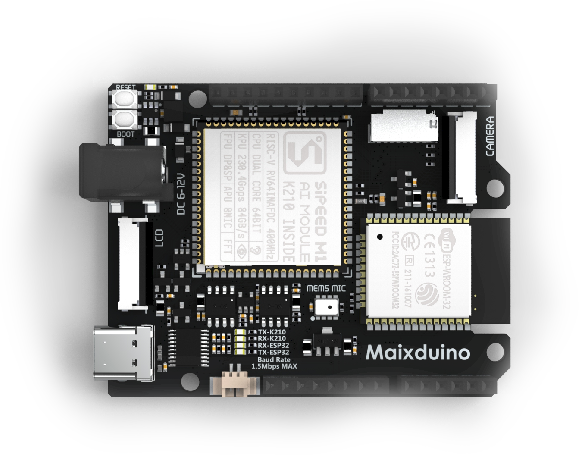

MaixPy Documentation
======

<div class="title_pic">
    
    
</div>

> Currently the only official document website: [maixpy.sipeed.com](https://maixpy.sipeed.com)</br>
> Development board information: [dl.sipeed.com](http://dl.sipeed.com), [wiki.sipeed.com](https://wiki.sipeed.com)

## What is MaixPy

MaixPy ported [Micropython](http://micropython.org/) to [K210](https://kendryte.com/) (a 64-bit dual-core RISC-V CPU with hardware FPU、FFT、sha256 and convolution accelerator). A project that supports MCU routine operations and integrates machine vision and microphone arrays to quickly develop intelligent applications in the `AIOT` field that are extremely cost effective and practical.


> MicroPython is a lean and efficient implementation of the Python 3 programming language that includes a small subset of the Python standard library and is optimised to run on microcontrollers and in constrained environments.

> K210 created for AIOT(AI+IOT) use, It's powerful performance and low cost are very competitive.


Micropython makes programming on K210 hardware easier, the code is open source and can be found on [GitHub]((https://github.com/sipeed/MaixPy))

For example if we want to find an **I2C** device, we just need this code:
```python
from machine import I2C

i2c = I2C(I2C.I2C0, freq=100000, scl=28, sda=29)
devices = i2c.scan()
print(devices)
```

Again, if we want to make a **breathing light** using PWM, we just need this code:
```python
from machine import Timer,PWM
import time

tim = Timer(Timer.TIMER0, Timer.CHANNEL0, mode=Timer.MODE_PWM)
ch = PWM(tim, freq=500000, duty=50, pin=board_info.LED_G)
duty=0
dir = True
while True:
    if dir:
        duty += 10
    else:
        duty -= 10
    if duty>100:
        duty = 100
        dir = False
    elif duty<0:
        duty = 0
        dir = True
    time.sleep(0.05)
    ch.duty(duty)
```

To **take a picture**：

```python
import sensor
import image
import lcd

lcd.init()
sensor.reset()
sensor.set_pixformat(sensor.RGB565)
sensor.set_framesize(sensor.QVGA)
sensor.run(1)
while True:
    img=sensor.snapshot()
    lcd.display(img)
```


## About this documentation

Everything related to MaixPy, mainly about
* How to choose and get a suitable module/development board
* How to get started with MaixPy, even if you are not an expert in hardware programming.
* Learn MicroPython language basics
* Libraries (API) reference

## Boards supported MaixPy

First of all, we need to choose a development board that suits your needs. The following ones are currently available:

* Dan dock with Sipeed M1(Dan) module

k.png)

* Sipeed Maix BiT


* Sipeed Maix Go


* Sipeed Maixduino



To get any of those boards or more boards, visit [Sipeed Wiki](https://wiki.sipeed.com/zh/maix/board/)


## MaixPy source code

If you want to participate in the development of MaixPy's built in features, you can download the source code and do a pull request.

MaixPy source is hosted on [GitHub](https://github.com/sipeed/MaixPy)

| Branch | Status |
| ------ | ------ |
| master | [](https://travis-ci.org/sipeed/MaixPy) |


This project was started by &copy;<a href="https://www.sipeed.com" style="color: #f14c42">Sipeed</a> Co.,Ltd. and accepts contributions from the open source community. You can see who contributed by checking the [list of contributors](https://github.com/sipeed/MaixPy/graphs/contributors)


## Source code of MaixPy documentation

Doumentation will be edited if the API code is changed.

The source of the documentation can be found on [GitHub](https://github.com/sipeed/MaixPy_DOC)

You **MUST** read the [documentation convention](contribute/doc_convention.md) before editing it!

|   Branch  |   Status  |
| --------- | --------------- |
| master |[](https://travis-ci.org/sipeed/MaixPy_DOC) |
| dev    |[](https://travis-ci.org/sipeed/MaixPy_DOC)    |


## Feedback

* [Feedback](https://github.com/sipeed/MaixPy/issues)

