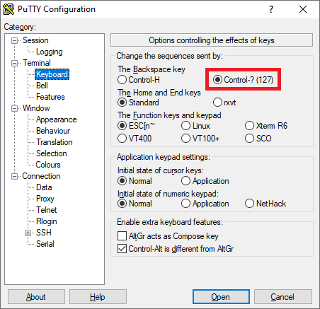
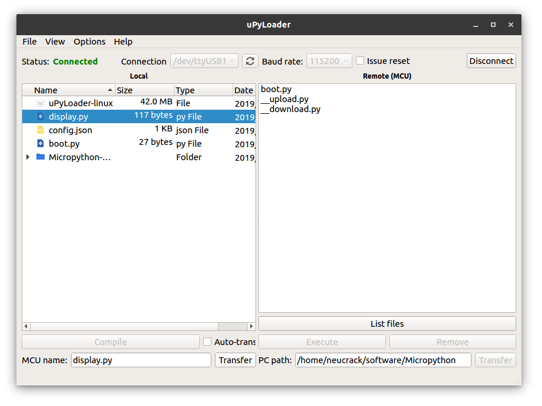

Editing, saving and executing files
=====

This section teaches you how to edit, save and execute files.


## REPL interface

To keep things simple in the [previous example](led_blink.md), we entered code directly in the terminal at the Maix prompt which was executed immediately upon pressing the Enter key.  Such interactive command line interfaces are often referred to as [`REPL（Read Eval Print Loop)`](https://en.wikipedia.org/wiki/Read%E2%80%93eval%E2%80%93print_loop). MaixPy's REPL interface operates similar to most other command line interfaces except that the supported syntax is [MicroPython](http://docs.micropython.org/en/latest/reference/repl.html)

While MaixPy's REPL interface is simple and convenient for small tasks, it soon becomes annoying to re-enter your code each time you want to run it.  The solution is to save your code to a file, and then execute the file.  The remainder of this page describes that process.


## MaixPy file system

MaixPy devices have an internal file system which can access both internal and external memories.  During boot, the device will mount any external memory cards formatted with either SPIFFS or FAT file systems, and add them to the internal file system as the `/flash` or `/sd` directories respectively.  

NOTES:

SPIFFS cards are by default assigned to `3MB` `SPIFFS` (starting at flash address `0xD00000`). When detected at boot, SPIFFS devices automatically appear as the `/flash` directory within the device's internal file system.  Currently the `SPIFFS` implementation in MaixPy does not support the creation of directories. 

FAT formatted SD (TF) cards are supported, but FAT32 or exFAT formatted cards are not currently supported.  When detected at boot, FAT formatted cards will be automatically mounted and appear as the `/sd` directory in the device's internal file system.  

It should be noted that the root directory is only used to mount the SD card or SPIFFS flash card. All other file operations happen in the `/flash` or `/sd` directories, as determined by the format of the memory card discovered at boot time.  


## Navigating the file system

In MaixPy's REPL interface and in code the following os commands can be used to navigate directories and manage files.

| Command | Description | Example |
|:------- |:----------- |:--------|
|`os.chdir()`| changes the current directory | `os.chdir("/flash")` |
|`os.listdir()` | list the files in the current directory | `os.listdir()` |
| `os.listdir(path)` | list the files in another directory | `os.listdir("/sd")`|
|`os.getcwd()`| return the current working directory | `os.getcwd()`|
|`os.rename(old_path, new_path)`| rename a file | `os.rename("./blue.py", "./aaah.py")`|
|`os.remove(path)`| remove a file | `os.remove("./herring.py")`|

For a complete list of os commands refer to the [MicroPython documentation](http://docs.micropython.org/en/v1.7/esp8266/library/os.html)


## Editing and saving files

There are a number of ways you can edit and save files described below as Methods A through C

### Method A: Edit and save files using the [pye editor](https://github.com/robert-hh/Micropython-Editor) built into MaixPy

MaixPy includes a built-in open source editor [Micropython Editor(pye)](https://github.com/robert-hh/Micropython-Editor)

At the REPL interface enter `pye("hello.py")` to create a file and enter the edit mode. Keyboard shortcuts and other instructions can be found [here](https://github.com/robert-hh/Micropython-Editor/blob/master/Pyboard%20Editor.pdf)

Enter the following code:

```python
print("hello maixpy")
```

When you have finished editing, press `Ctrl+S` and then press `Enter` to save, and then press `Ctrl+Q` to exit the editor.

**Note** : The pye editor has certain requirements of the connected terminal. For intuitive operation the `BackSpace` key should be configured to send `Ctrl+?`, otherwise the `BackSpace` key will function as `Ctrl+H` (ie: character replacement).

Linux users are recommended to use `minicom`. Use `sudo minicom -s` to set the reference to [the previous tutorial](serial_tools.md)

Windows users can use [PuTTY](https://www.chiark.greenend.org.uk/~sgtatham/putty/latest.html) which supports Backspace key configuration.



**Note** Typing Shift-Backspace will cause PuTTY to send whichever code isn't configured as the default.

Alternatively, Xshell users can use:

```
File → Properties → Terminal → Keyboard,
Change the delete and backspace sequences to ASCII 127.
```

### Method B: Read files to PC by [uPyLoader](https://github.com/BetaRavener/uPyLoader), then download to board after editing

This method uses the [uPyLoader](https://github.com/BetaRavener/uPyLoader) utility

Download the executable: [release](https://github.com/BetaRavener/uPyLoader/releases)



Select the serial port and click the `Connect` button to connect the board

The first time you run the software, you need to initialize it. Click `File->Init transfer files` to complete the initialization. This will create two files in the board, `__upload.py` and `__download.py`.

Then double click file name to read and edit, then click the `save` button to download the file to board

### Method C: Read files to PC by [rshell](https://github.com/dhylands/rshell), edit, and then save back to board

Install [rshell](https://github.com/dhylands/rshell) first according to the doc of `rshell`

```python
sudo apt-get install python3-pip
sudo pip3 install rshell
rshell -p /dev/ttyUSB1 # select board serial
```

Edit file

```python
ls /flash
edit /flash/boot.py
# the editor uses vim commands
```


## Execution of documents

Once MicroPython files exist on the file system they may be executed using the following methods

### Method A: Execute using `import`

At MaixPy's REPL interface simply enter:
`import hello` then press Enter

The `hello.py` file will run and should output `hello maixpy`

But be careful, the `import` command can only be used once.  If you want to execute the code more than once, please use `Method B` below.

### Method B: Execute using `exec()`

Use `exec()` in a simple program to execute your file

```python
with open("hello.py") as f:
    exec(f.read())
```

### Method C: Execute using uPyLoader

Just select the file, then click the `execute` button

### Method D: Execute files locally on PC using ampy

[ampy](https://github.com/pycampers/ampy) 

run script by command `ampy run file_in_PC.py` to execute files on PC (file won't transmit to board)

