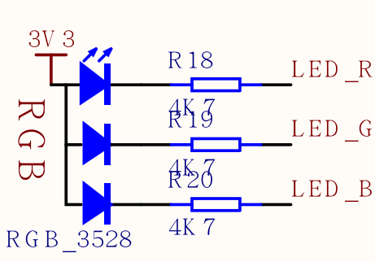

Lighting the LED
==========


The lighting program is the first program to learn all the development boards. Just like learning all programming languages, learning the hello world is a sacred meaning.

It is well known that lighting an LED requires a power supply, a resistor, and an LED bulb. On the Dan Dock development board, there are three LEDs, the lines are as follows:




For example, we want to red light, i.e., `LED_R` connected to the LED, the LED can be seen in FIG positive 3.3V power supply has been connected, so long as we can LED_R LED lighting is low.

Before writing the program, we need to know that the corresponding pins of the on-chip peripherals (such as GPIO, I2C, etc.) of the hardware K210 used by MaixPy can be arbitrarily set. The STM32 on-chip peripherals and pin correspondences have been fixed. Some of the pins can be multiplexed, compared to the K210 with greater degrees of freedom.

> For example, I2C can use Pin11 and Pin12, or can be changed to any other pin.

We control the LEDs and need to use GPIO

The procedure is as follows:

```python

from Maix import GPIO

fm.register(board_info.LED_R, fm.fpioa.GPIO0)

led_r=GPIO(GPIO.GPIO0,GPIO.OUT)
led_r.value(0)
```

We only need to click the lines of the code one by one to the keyboard inside the terminal and press OK to execute.

Among them, we start with the package `Maix` introduced `GPIO` this class;

Front pin can be set K210, so we use `.fm`(fpioa manager) correspondence between peripherals and pin registration chip built-in object to this, here　`fm.fpioa.GPIO0` is a GPIO Peripheral K210's ( `Note the difference between GPIO (peripheral) and pin (real hardware pin)`), so the `fm.fpioa.GPIO0` registration to pin `board_info.LED_R`;

Here `board_info` is a board type information can be entered in serial terminal `board_info.` then press `TAB` the button to see all the members, each pin largely value

Then define a `GPIO` subject, specific parameters to see `GPIO` the module's documentation, look in the left sidebar.

Use `led_r.value(0)` or `led_r.value(1)` to set high to low

It is already possible to light up here. If you know the Python syntax, you can try to write a for loop to achieve LED flashing~


