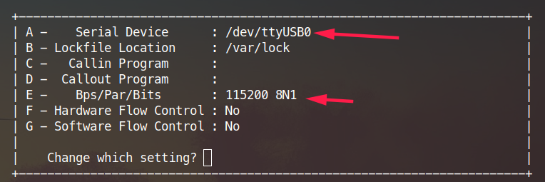
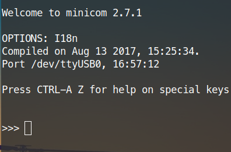

Power up the device, first time setup with MaixPy
========

## Connecting hardware

Connect the Type C cable, one end of the computer development board

Check to see if the device has been properly identified:

Under Linux can `ls /dev/ttyUSB*` or `ls /dev/ttyACM*` to see, if not you can `ls /dev` come look for the specific device name with the relevant serial chip and drive

Under Windows, you can open Device Manager to view

If the device is not found, you need to confirm if the driver is installed and if the contact is good.


## Using the serial port tool


### Linux

Use `minicom` or `screen` tool.

#### minicom

```
sudo apt update
sudo apt install minicom
sudo minicom -s
# Then set the serial port number according to the prompt and the baud rate is 115200. Do not know how to search using the search tool.
# Set Backspace to DEL function
# Set linewrap to Yes
sudo minicom
```

Note that minicom's default configuration file save requires sudo permission, so use `sudo minicom -s`




Press here `A` to set the device

Press `E` to set the baud rate, the baud rate needs to be set `115200`


Here press `A` and `R` the setting is switched to the setting in the drawing as the first to use the latter `pye` editor shortcuts do not conflict, is provided to wrap the second one is to be able to display full output

After setting save and exit, next time do not need to set up is required only if `sudo minicom` you can, if you do not want to use every time `sudo` a command is executed `sudo usermod -a -G dialout $(whoami)` to add themselves to the `dialout` user groups can be, may need to log off or reboot to take effect, note that `sudo minicom -s` if you use The default profile is still needed `sudo`

After entering `minicom`, click the Enter button to see the interactive interface of MaixPy.



Input `help()`, you can view help

To exit `minicom`, press `Ctrl+A` `X`, press `Enter` confirm to exit

#### Screen

```
sudo apt update
sudo apt install screen
sudo screen /dev/ttyUSB0 115200
```
Then click the Enter button to see the interactive interface of MaixPy.

`>>>`

Input `help()`, you can view help

To exit `screen`, press `Ctrl+A` `K` and press `Y` confirm to exit


### Windows

Use tools like [putty](https://www.putty.org/) or [xshell](https://xshell.en.softonic.com/)

Then select the serial port mode, then set the serial port and baud rate to open the serial port.

Then click the Enter button to see the interactive interface of MaixPy.

`>>>`

Input `help()`, you can view help