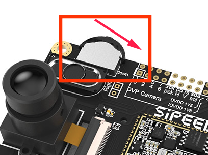

Update MaixPy firmware
===========


## Connecting hardware

Connect the Type C cable, one end to the development board, one end to the computer


## Install the driver

The main reason is to install the serial port driver, because the board is connected to the computer through the USB to serial device. Install the driver according to the board's USB to serial port chip model.

> Operate the serial port under `Linux` or `Mac`. If you don't want to use the `sudo` command every time, execute `sudo usermod -a -G dialout $(whoami)` to add yourself to the `dialout` user group. May need to be logged off or restarted to take effect

### For `Dan Dock` or `Maix Bit`

the CH340 used by the Dan_Dock development board: Linux does not need to install the driver. The system comes with it. You `ls /dev/ttyUSB*` can see the device number by using Windows. You can search and download the installation on the Internet, and then you can `Device manager` see the serial device in it.


### For `Maix Go`

The development board uses a `STM32` to implement the analog serial port and the `JTAG` function.

The firmware of this `STM32` chip is factory defaulted to [open-ec](https://github.com/sipeed/open-ec) firmware. If there is no problem, one or two serial ports will appear, such as `Linux` Two serial ports `/dev/ttyUSB0` and `/dev/ttyUSB1` appear below. Please use `/dev/ttyUSB1` when downloading and accessing the serial port. Windows is similar.

If you need to re-burn this firmware, you can download it from [github](https://github.com/sipeed/open-ec/releases) or [open-ec firmware](http://dl.sipeed.com/ MAIX/tools/flash-zero.bin), then use the `STM32`'s `SW` pins (`GND`, `SWDIO`, `SWCLK`) from the `ST-LINK` connection board for programming. (The `STM32` on the current version of the `Go` board does not support serial port burning. It can only be burned using `ST-LINK`. Please purchase it if you need it, or use a board with 'IO` simulation. Such as the Raspberry Pi))

In addition to `open-ec` and `CMSIS-DAP` firmware, compared to `open-ec` can simulate `JTAG` to debug the board, `open-ec` does not currently support emulation `JTAG`, can [from Download the firmware on the official website](http://dl.sipeed.com/MAIX/tools/maix_go_cmsisdap_new.hex), use `ST-LINK` to burn it, and ``dev/ttyACM0` device will appear under `Linux`

> ST-LINK has a very complete description of the burning method of `STM32`, please search for yourself.


## Get the upgrade tool

### Ubuntu(Linux)

Download tool:[kflash.py](https://github.com/sipeed/kflash.py)

```bash
sudo apt update
sudo apt install git python3 python3-pip
sudo pip3 install pyserial
git clone https://github.com/sipeed/kflash.py
```

### Windows

K-Flash: Download from [github](https://github.com/kendryte/kendryte-flash-windows/releases)

Or download from the official [kendryte](https://kendryte.com/downloads/) page

If it is the `Maix Go` development board, currently only the `kflash.py` script can be used for burning, so you need to install `python3` on your computer.

Then download [kflash.py](https://github.com/sipeed/kflash.py)


## Get the firmware

Download from [github](https://github.com/sipeed/MaixPy/releases) page

Firmware ends with `.bin` or `.kfpkg`

Firmware naming instructions:

* maixpy_v###_full.bin: The full version of MaixPy firmware (MicroPython + OpenMV API + lvgl)
* maixpy_v###_no_lvgl.bin: MaixPy firmware without LVGL version. (LVGL is an embedded GUI framework, you need to use when writing the interface)
* maixpy_v###_minimum.bin: MaixPy firmware minimum set. Does not support `MaixPy IDE`, does not include `LVGL` nor `OpenMV`
* face_model_at_0x300000.kfpkg: Face model, placed in address 0x300000, can be downloaded multiple times from `.bin` without conflict
* elf.7z: elf file, ordinary users do not care, used for crash debugging


## Download the firmware to the development board

### Linux

Use the following command to burn, you can use it `python3 kflash.py --help` to get help.

```
sudo python3 kflash.py -p /dev/ttyUSB0 -b 2000000 -B dan firmware.bin
```

* Which `-p` is the specified device, you can `ls /dev/ttyUSB*` view the device 
* `-b` is specified baud rate, if the download fails, you can try again to reduce the baud rate 
* `-B` is specified board, without the support of the model do not worry, you can still download, but may need to download after Manual reset to start.  Where `Maix Go` uses `-B goD` (`STM32` has burned `CMSIS-DAP` firmware) or `-B goE` (`STM32` has burned `open-ec` firmware)

> `Maix Go` If the confirmation option is correct and still cannot be downloaded, you can try to dial the three-phase dial button to the position of `Down` and keep downloading again.



### Windows

Run the downloaded software in two machines, select firmware, serial port, etc. after running, click to download


If the development board is `Maix Go`, you can only use `kflash.py` to download it. The download method is the same as the method on `Linux`, see above.

