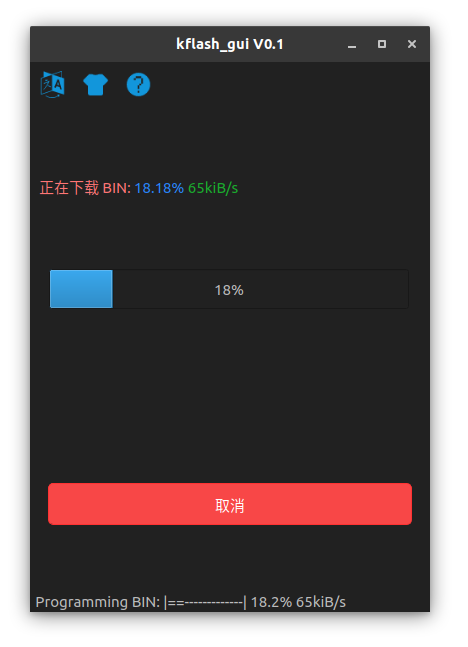

Upgrade MaixPy firmware
===========

## Connecting the board

Connect the Type C cable, one end to the development board, one end to the computer.


## Install driver

Install driver as described above

## Get the upgrade tool

* Download [kflash_gui](https://github.com/sipeed/kflash_gui/releases) and you will get a zip file.
> kflash_gui is cross-platform, it can work on multiple systems (including Windows, Linux, MacOS or even Raspberry Pi)

Extract the downloaded file to a folder, then double-click kflash_gui.exe to run the app.

* Or use terminal tool
```
pip3 install kflash
kflash --help
kflash -p /dev/ttyUSB0 -b 1500000 -B goE maixpy.bin
```

## Get firmware

* The release version of the firmware is downloaded from the [GitHub page](https://github.com/sipeed/MaixPy/releases)
* The automated builds can be downloaded from [here](http://dl.sipeed.com/MAIX/MaixPy/release/master/)

Firmware files have the `.bin` or `.kfpkg` extension

You can pack `kfpkg` file with `kflash_gui`, or manually according to this [kfpkg doc](http://blog.sipeed.com/p/390.html)

Firmware naming instructions:

* `maixpy_v*.bin`： Full version of MaixPy firmware (MicroPython + OpenMV API etc.)
* `maixpy_v*_with_lvgl.bin`： MaixPy firmware, with LVGL version. (LVGL is an embedded GUI framework, you need to use when writing the interface)
* `maixpy_v0.3.1_minimum.bin`： MaixPy firmware minimum set, not supported ´by `MaixPy IDE`, does not contain OpenMVrelated algorithms
* `face_model_at_0x300000.kfpkg`： Face model, placed in address 0x300000, can be downloaded multiple times without conflict
* `elf.7z`： elf file, ordinary users do not care, used for crash debugging

## Upload firmwre to the development board

* Open `kflash_gui`

* Select the firmware, set the options and then click to download. For more features, or instructions on how to use the tool, check the [kflash_gui project page](https://github.com/sipeed/kflash_gui)




> For the early `Maix Go`， if the download fails, try holding the three-phase dial to the `down` location during the download procedure.

