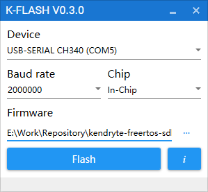

Update MaixPy firmware
===========


## Connecting hardware

Connect the Type C cable, one end to the development board, one end to the computer

## Install the driver

The main reason is to install the serial port driver, because the board is connected to the computer through the USB to serial device. Install the driver according to the board's USB to serial port chip model.

For example, the CH340 used by the Dan_Dock development board: Linux does not need to install the driver. The system comes with it. You `ls /dev/ttyUSB*` can see the device number by using Windows. You can search and download the installation on the Internet, and then you can `Device manager` see the serial device in it.

## Get the upgrade tool

### Ubuntu(Linux)

Download tool:[kflash.py](https://github.com/sipeed/kflash.py)

```bash
sudo apt update
sudo apt install git python3 python3-pip
sudo pip3 install pyserial
git clone https://github.com/sipeed/kflash.py
```

### Windows

K-Flash: Download from [github](https://github.com/kendryte/kendryte-flash-windows/releases)

Or download from the official [kendryte](https://kendryte.com/downloads/) page

## Get the firmware

Download from [github](https://github.com/sipeed/MaixPy/releases) page


## Download the firmware to the development board

### Linux

Use the following command to burn, you can use it `python3 kflash.py --help` to get help.

```
sudo python3 kflash.py -p /dev/ttyUSB0 -b 2000000 -B dan firmware.bin
```

> Which `-p` is the specified device, you can `ls /dev/ttyUSB*` view the device 
> `-b` is specified baud rate, if the download fails, you can try again to reduce the baud rate 
> `-B` is specified board, without the support of the model do not worry, you can still download, but may need to download after Manual reset to start

> If you don't want to use the `sudo` command every time , you can `sudo usermod -a -G dialout $(whoami)` add yourself to the `dialout` user group, you may need to log out or restart to take effect.

If the board is to develop `Maix Go` and use `open-ec` firmware is currently available for download kflash.py script, `-B` parameters, please choose `kd233`

### Windows

Run the downloaded software in two machines, select firmware, serial port, etc. after running, click to download



If the board is to develop `Maix Go` and use `open-ec` firmware is currently available for download kflash.py script, `-B` parameters, please choose `kd233`

