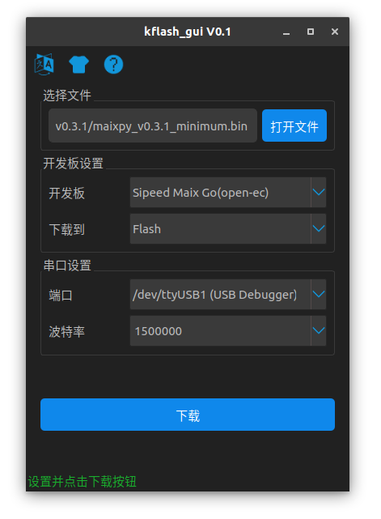

Upgrade MaixPy firmware
===========

## Connecting the board

Connect the Type C cable, one end to the development board, one end to the computer.

## Install the driver

We need to install the serial port driver as the board is connected to the computer through the USB to serial converter. Install the driver according to the board's USB to serial port chip model.

> In you are using `Linux` or `Mac` and you don't want to use `sudo` every time, add yourself to the `dialout` users group with the following command: `sudo usermod -a -G dialout $(whoami)`

### For `Dan Dock` or `Maix Bit`

The CH340 chip is being used, Linux does not need to install the driver as the system already comes with it. Execute `ls /dev/ttyUSB*` to check if the device is found. If using Windows, search and download the drivers on the Internet, then open `Device manager` and look if the serial port is listed.

### For `Maix Go`

An `STM32` is being used to implement the serial port and the `JTAG` functionality.

By default, this `STM32` chip is running a build of the [open-ec](https://github.com/sipeed/open-ec) firmware. If everything is right, one or two serial ports will appear. In `linux` the following two serial ports will appear: `/dev/ttyUSB0` and `/dev/ttyUSB1`. Please use `/dev/ttyUSB1` when downloading and accessing the serial port. Windows is similar.

If you need to re-burn this firmware, you can download it from [GitHub](https://github.com/sipeed/open-ec/releases) or [open-ec firmware](http://dl.sipeed.com/MAIX/tools/flash-zero.bin), then use the `STM32`'s `SW` pins (`GND`, `SWDIO`, `SWCLK`) from the `ST-LINK` connection board for programming. (The `STM32` on the current version of the `Go` board does not support serial port burning. It can only be burned using `ST-LINK`. Please purchase it if you need it, or use a board with `IO simulation` such as the Raspberry Pi))

Currently, `open-ec` cannot simulate `JTAG` to debug the board. Use `CMSIS-DAP` to do so. You can download it [from the official website](http://dl.sipeed.com/MAIX/tools/maix_go_cmsisdap_new.hex) and then burn it using an `ST-LINK`. Afterwards, `/dev/ttyACM0` will appear under `linux`.

> ST-LINK has a very complete description of the burning method of `STM32`, please search for yourself.

**Please note that updating the firmware of STM32 is not the same as updating the MaixPy firmware. Generally, you do not need to update the firmware of STM32. The default is enough. STM32 is just a USB to serial port tool! Do not be confused.**

### For the new `Maixduino` and `Maix Bit` versions that come with a microphone (using a `CH552` chip)

For the boards with a `CH552` chip, to get the `USB` serial port, `FT2232` drivers need to be installed. Search yourself for `FT2232 drivers`. In those boards, the `JTAG` function is not available.

## Get the upgrade tool

Download [kflash_gui](https://github.com/sipeed/kflash_gui/releases) and you will get a zip file.
> kflash_gui is cross-platform, it can work on multiple systems (including Windows, Linux, MacOS or even Raspberry Pi)

Extract the downloaded file to a folder, then double-click kflash_gui.exe to run the app.

## Get firmware

* The release version of the firmware is downloaded from the [GitHub page](https://github.com/sipeed/MaixPy/releases)
* The automated builds can be downloaded from [here](http://dl.sipeed.com/MAIX/MaixPy/release/master/)

Firmware files have the `.bin` or `.kfpkg` extension

To package `kfpkg` files, check this [link](http://blog.sipeed.com/p/390.html)

Firmware naming instructions:

* `maixpy_v*_no_lvgl.bin`： MaixPy firmware, without LVGL version. (LVGL is an embedded GUI framework, you need to use when writing the interface)
* `maixpy_v*_full.bin`： Full version of MaixPy firmware (MicroPython + OpenMV API + lvgl)
* `maixpy_v0.3.1_minimum.bin`： MaixPy firmware minimum set, not supported ´by `MaixPy IDE`, does not contain OpenMVrelated algorithms
* `face_model_at_0x300000.kfpkg`： Face model, placed in address 0x300000, can be downloaded multiple times without conflict
* `elf.7z`： elf file, ordinary users do not care, used for crash debugging

## Download firmwre to the development board

* Open `kflash_gui`

* Select the firmware, set the options and then click to download. For more features, or instructions on how to use the tool, check the [kflash_gui project page](https://github.com/sipeed/kflash_gui)

> For the early `Maix Go`， if the download fails, try holding the three-phase dial to the `down` location during the download procedure.

