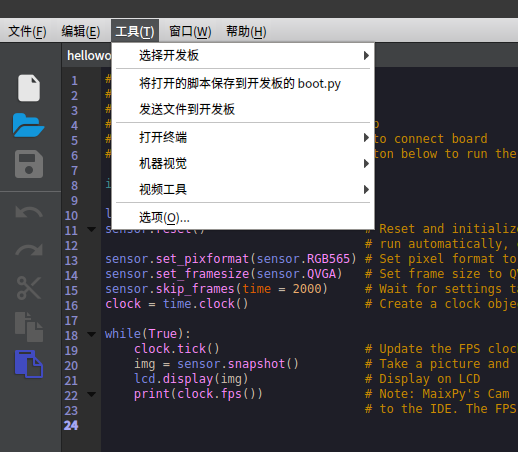

Upload script to development board
======

Earlier we came across the `pye("filename.py")` command to open an editor that directly edits files in the file system.

But slowly we will find that this method is only suitable for changing a small amount of code. When the amount of code is huge or we need to highlight support, it does not apply. We need to write the code on the computer and upload it to the board.

There are currently several methods:

## Uploading scripts using the MaixPy IDE

Open the `MaixPy IDE` and connect to the development board.

Edit the file, then in the top `Tools` menu click `Save opened file as boot.py` to save the code to the development board's `boot.py` file. The next time the board is powered on, it will be automatically executed.

You can also use the `Send file` option in the `Tools` menu to send the file. It will be saved to the development board with the same name. This script can also upload other small files.



## Uploading and running scripts using the graphical tool uPyLoader

[uPyLoader](https://github.com/BetaRavener/uPyLoader) is an open source software that allows you to easily connect to MaixPy and upload, download, and execute files, monitor output, and more.

Download the executable: [release](https://github.com/BetaRavener/uPyLoader/releases)


Select the serial port and click the `Connect` button to connect the board

The first time you run the software you will need to initialize it. Click `File -> Init transfer files` to complete the initialization. This will create two files in the board, `__upload.py` and `__download.py`.

On the left side select the file you want to upload and click `Transfer` to upload it to the board's file system.

On the right side are the files inside the board, click `List files` to refresh the file list. To execute the script, simply select the file name and click on `Execute`.

Click on `View -> Terminal` above to open the terminal to view the runtime output or send a command

## Using rshell tool

Just as widh the `linux`, use the `cp` on [rshell](https://github.com/dhylands/rshell) to copy the file to the development board.

First, install rshell:
```python
sudo apt-get install python3-pip
sudo pip3 install rshell
rshell -p /dev/ttyUSB1 # choose the device according to your serial port
```

Then copy file~

```python
ls /flash
cp ./test.py /flash/ # copies the file "text.py" from the computer to the root directory of the development board
```

You can learn about other features of rshell in its [project page](https://github.com/dhylands/rshell).

## Using the command line tool ampy

[ampy](https://github.com/pycampers/ampy) is an open source, easy-to-use command line tool for uploading, downloading, and executing files.

Note that this tool is running on the computer, not on the board.

Use `ampy --help` to view help and information.

The `ampy run file_in_PC.py` command also allows you to run the script directly on the board without uploading it previously.

## TF card copy

After copying it to the TF card, execute `import filename` in the terminal to run the script.
