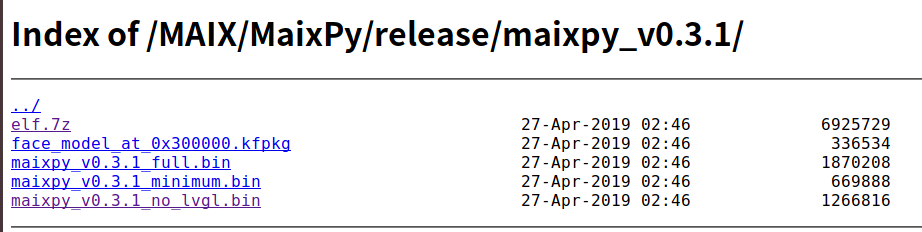
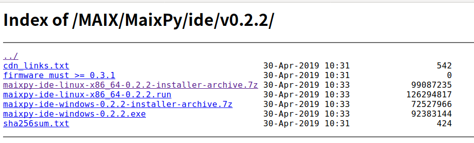
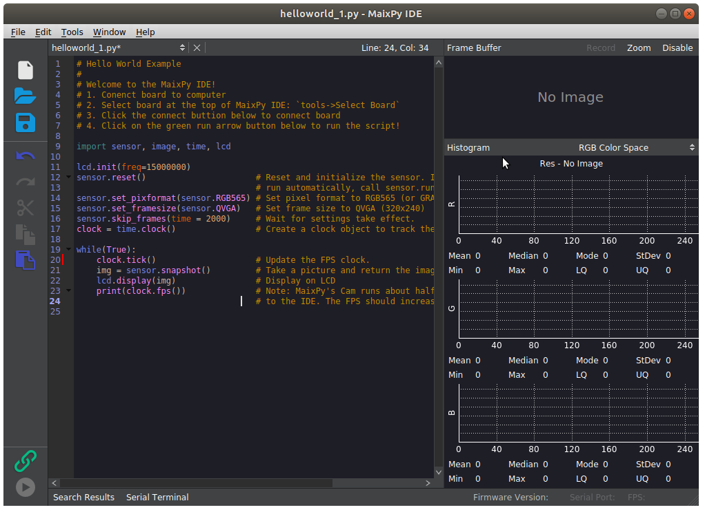
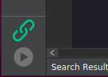
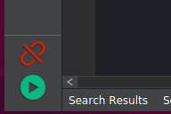

# MaixPyIDE详细安装指南-Ubuntu


[TOC]


## 下载MaixPy固件

MaixPyIDE对MaixPy固件的版本是有要求的, 必须是`v0.3.1` 版本以上, 否则MaixPyIDE上会连接不上.

[MaixPy-Release固件下载链接](https://github.com/sipeed/MaixPy/releases)

选择最新的固件版本下载.


下载MaixPy`v0.3.1`的固件 [下载地址](http://dl.sipeed.com/MAIX/MaixPy/release/maixpy_v0.3.1/)



这里解释一下列表中不同版本的区别


* `elf.7z `    固件合集                                       
* `face_model_at_0x300000.kfpkg` 人脸模型，放置在地址位 `0x300000`                  
* `maixpy_v0.3.1_full.bin`  完整版的MaixPy固件(MicroPython +  OpenMV API + lvgl )                       
* `maixpy_v0.3.1_minimum.bin`  MaixPy固件最小集合，只有MicroPython硬件控制部分                
* `maixpy_v0.3.1_no_lvgl.bin`  MaixPy固件, 不带LVGL版本.(LVGL是嵌入式GUI框架, 写界面的时候需要用到)


选择`maixpy_v0.3.1_full.bin` 下载完整版的MaixPy固件.


## KFlash固件下载工具

### 下载KFlash

MaixPy固件更新需要借助一个名字叫做**kflash**的工具.从github下载kflash

[KFlash下载地址](https://github.com/kendryte/kendryte-flash-windows/releases)

或者直接用git 克隆KFlash这个仓库

```bash
git clone https://github.com/sipeed/kflash.py
```

[更新 MaixPy 固件-MaixPy官方文档](https://maixpy.sipeed.com/zh/get_started/upgrade_firmware.html#%E6%9B%B4%E6%96%B0-maixpy-%E5%9B%BA%E4%BB%B6)

将刚刚下载好的`maixpy_v0.3.1_full.bin` 固件放置到`kflash.py`同极目录下

```bash
$ ls -1
cmd.txt
kflash.py
LICENSE
maixpy_v0.3.1_full.bin
README.md

```

### KFlash固件烧录

终端进入到`kflash.py`文件夹, 执行如下指令

```
sudo python3 kflash.py -p /dev/ttyUSB0 -b 2000000 -B dan maixpy_v0.3.1_full.bin
```

注: 这里开发板型号选择的是MaixPy Dan开发板, 如果是其他型号请阅读"KFlash可选项说明"

**固件烧录日志**

```bash
$ sudo python3 kflash.py -p /dev/ttyUSB0 -b 2000000 -B dan maixpy_v0.3.1_full.bin
[sudo] password for akai: 
[INFO] COM Port Selected Manually:  /dev/ttyUSB0 
[INFO] Default baudrate is 115200 , later it may be changed to the value you set. 
[INFO] Trying to Enter the ISP Mode... 
.
[INFO] Greeting Message Detected, Start Downloading ISP 
[WARN] Use built-in ISP_PROG2, If you download firmware to flash  failed, please use -i1
Downloading ISP: |==================================================| 100.0% 
[INFO] Booting From 0x80000000 
[INFO] Wait For 0.3 second for ISP to Boot 
[INFO] Boot to Flashmode Successfully 
[INFO] Selected Baudrate:  2000000 
[INFO] Selected Flash:  On-Board 
Downloading: |==================================================| 100.0% 
[INFO] Rebooting... 
```


### KFlash可选项说明

```
optional arguments:
  -h, --help            show this help message and exit
     					查看帮助指令
  -p PORT, --port PORT  COM Port
  	 					选择端口号
  -c CHIP, --chip CHIP  SPI Flash type, 1 for in-chip, 0 for on-board
     					选择芯片模式 1:芯片 0:开发板
  -b BAUDRATE, --baudrate BAUDRATE
                        UART baudrate for uploading firmware
     					上传固件的时候串口的波特率
  -i, --isp             choose which built-in ISP_PROG
  -l BOOTLOADER, --bootloader BOOTLOADER
                        bootloader bin path
  -k KEY, --key KEY     AES key in hex, if you need encrypt your firmware.
      					秘钥,AES加密用
  -v, --verbose         increase output verbosity
  -t, --terminal        Start a terminal after finish (Python miniterm)
   	   					完成后自动开启终端
  -B BOARD, --Board BOARD
                        Select dev board, dan or kd233 or goD or goE, default dan
       					选择开发板类型, 可选项
       					* dan
       					* kd233
       					* goD
       					* goE
  -n, --noansi          Do not use ANSI colors, recommended in Windows CMD
```


## 通过picocom连接MaixPy的REPL

使用picocom连接开发板的REPL

如果之前没有安装picocom的话,需要通过apt安装

```bash
sudo apt install picocom
```

使用picocom连接MaixPy

```bash
 sudo picocom -b 115200 /dev/ttyUSB0
```

出现`>>>` 就意味着你可以在REPL里面写MicroPython的代码了, 如果没有出现的话，可以回车几次，或者使用快捷键`CTRL + C` 中断当前的循环．

输入快捷键`CTRL+D` MaixPy软重启, 在REPL里可以看到固件版本信息，日志输出如下:

```python
>>> 
[MaixPy]: soft reboot
heap0=0x801c97b8
[MaixPy] sd_init | SD_CMD0 is FF

 __  __              _____  __   __  _____   __     __
|  \/  |     /\     |_   _| \ \ / / |  __ \  \ \   / /
| \  / |    /  \      | |    \ V /  | |__) |  \ \_/ /
| |\/| |   / /\ \     | |     > <   |  ___/    \   /
| |  | |  / ____ \   _| |_   / . \  | |         | |
|_|  |_| /_/    \_\ |_____| /_/ \_\ |_|         |_|

Official Site : https://www.sipeed.com
Wiki          : https://maixpy.sipeed.com

MicroPython v0.3.1 on 2019-04-27; Sipeed_M1 with kendryte-k210
Type "help()" for more information.
>>> 

```

详情请继续阅读官方文档,  学习REPL的使用．

[点亮LED-MaixPy官方文档](https://maixpy.sipeed.com/zh/get_started/led_blink.html)


在继续下面的IDE安装与使用教程，请记得退出REPL，因为MaixPy IDE本质上也是通过REPL来执行MicroPython代码的, **二者不能同时使用**.

退出REPL的快捷键为`CTRL+A` 然后`CTRL+Q`.

```python
>>> 
Thanks for using picocom
$ 
```


## MaixPy IDE安装与使用教程

### 下载IDE安装包

下载MaixPy IDE

http://dl.sipeed.com/MAIX/MaixPy/ide/

下载MaixPy IDE的最新版本, 目前的ide版本是`v0.2.2` . 



选择Ubuntu对应的安装包版本, 点击下载文件`maixpy-ide-linux-x86_64-0.2.2-installer-archive.7z`

> 注: Ubuntu浏览器下载比较慢, 可以在Windows下，用迅雷等下载工具下载，然后再copy至Ubuntu.


### 安装包解压

在Ubuntu下安装7z并解压缩MaixPyIDE的打包文件

安装7z

```bash
sudo apt install p7zip-full
```

使用7z解压缩安装包

```
 7z x maixpy-ide-linux-x86_64-0.2.2-installer-archive.7z -r -omaixpy-ide
```

`-o` 后面直接跟解压缩的路径, 中间没有空格.

解压后的文件结构如下图所示:

```bash
$ ls -1
bin <- 二进制文件
lib
README.txt
setup.sh　<- 初始化脚本
share
```


### 安装MaixPy IDE 相关依赖

给`setup.sh` 赋予执行权限

```bash
sudo chmod +x setup.sh
```

然后执行`setup.sh` 脚本.

```
sudo ./setup.sh
```

这个脚本会自动安装IDE依赖的包.


### 运行MaixPy IDE

`MaixPyIDE/bin` 文件里面有一个可执行文件

```bash
maixpy-ide/bin$ ls -1
maixpyide <- 可执行文件
maixpyide.sh
qt.conf
```


`maixpyide` 在终端中运行

```bash
./maixpyide
```

IDE的运行界面如下图所示:




### Helloworld例程

IDE运行之后，代码编辑区会显示`HelloWorld`例程，拍照然后在LCD液晶屏显示图像．

```python
# Hello World Example
#
# Welcome to the MaixPy IDE!
# 1. Conenct board to computer
# 2. Select board at the top of MaixPy IDE: `tools->Select Board`
# 3. Click the connect buttion below to connect board
# 4. Click on the green run arrow button below to run the script!

import sensor, image, time, lcd

lcd.init(freq=15000000)
sensor.reset()                      # Reset and initialize the sensor. It will
                                    # run automatically, call sensor.run(0) to stop
sensor.set_pixformat(sensor.RGB565) # Set pixel format to RGB565 (or GRAYSCALE)
sensor.set_framesize(sensor.QVGA)   # Set frame size to QVGA (320x240)
sensor.skip_frames(time = 2000)     # Wait for settings take effect.
clock = time.clock()                # Create a clock object to track the FPS.

while(True):
    clock.tick()                    # Update the FPS clock.
    img = sensor.snapshot()         # Take a picture and return the image.
    lcd.display(img)                # Display on LCD
    print(clock.fps())              # Note: MaixPy's Cam runs about half as fast when connected
                                    # to the IDE. The FPS should increase once disconnected.

```

### MaixPy IDE连接MaixPy开发板

打开IDE, 上方工具栏里面选择开发板的型号.

`Tool-> Select Board -> Sipeed MaixPy Dan`

点击`connect连接MaixPy IDE`



连接成功之后，链接按钮会由绿变红．



连接按钮下方是运行按钮，会执行当前编辑区的`py`文件．


再次点击运行按钮(红色), 停止运行当前代码．