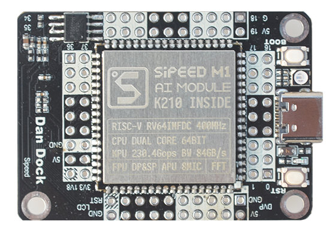

Sipeed M1 (Lichee Dan) Dock Board
===============

* Dan dock with Sipeed M1(Dan) module

* Maix M1/M1W 模组
* 1 个 RGB 灯（1红+1绿+1蓝）
* 2 个按钮（复位+启动(开机后可自定义功能)按钮）
* Type-C 接口
* Micro SD 卡槽
* CH340(新版是CH552) USB 转 TTL 芯片
* 2 个 FPC 座子（摄像头和屏幕）
* 1 个 Mic
* 1 个音频功放（PAM8403）

更多关系开发板信息请看[Wiki 页面](https://wiki.sipeed.com/zh/maix/board/dock.html)

* 资料下载： [dl.sipeed.com](http://dl.sipeed.com/)

